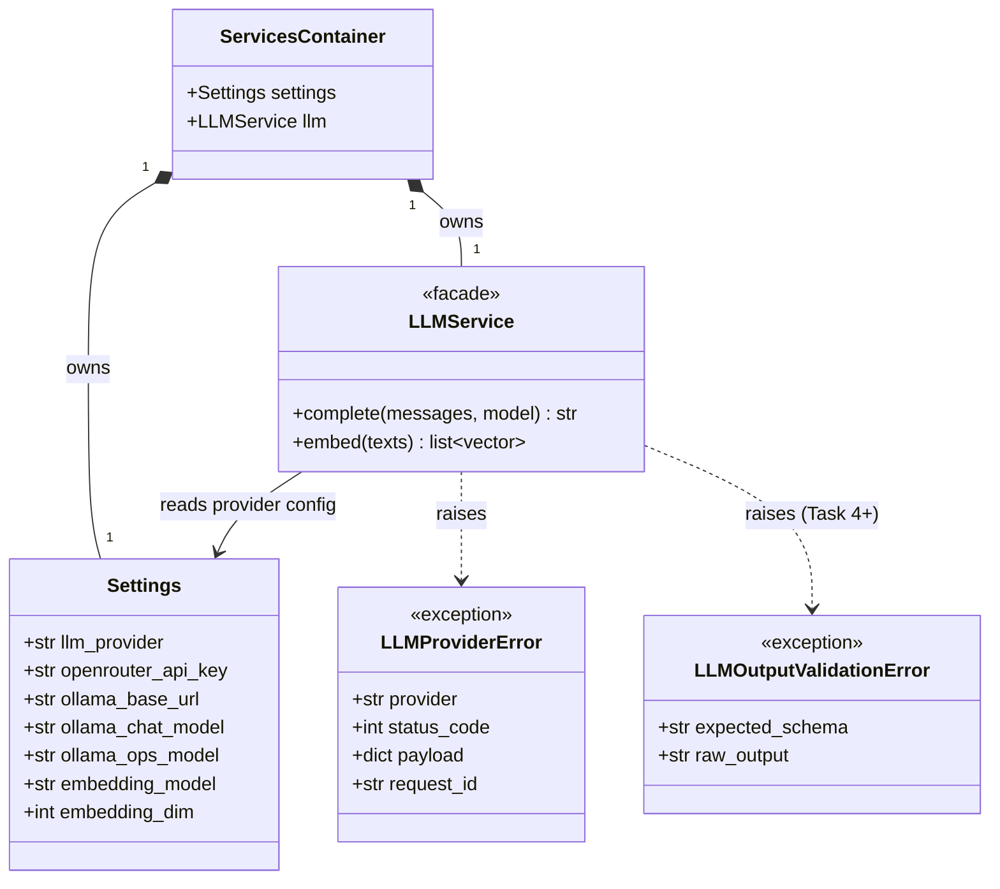

# Task 1 — Foundations (REASONS Canvas)

> **Maps to:** Learning Plan Week 1 — *Python Foundations & Service Abstractions*.
> **Depends on:** `Task_0_Environment.md`.
> **Unblocks:** `Task_2_Ingestion.md`, `Task_3_Orchestration.md`.

---

## Requirements

### Analysis context

**Domain keywords scanned:** LLMService, OpenRouter, Ollama,
embeddings, settings, request_id, structured logging, retries.
**Existing artifacts:** `.env.example`, the `app/` skeleton from
Task 0. **Prior tasks read:** Task 0 (env keys, healthz, settings
stub).

**Strategic direction:** one provider-agnostic facade over chat +
embeddings, configured by `Settings`. Retries and structured-output
parsing live behind the facade, never in the caller. Errors are
typed (`LLMProviderError`, `LLMOutputValidationError`) so callers
can decide policy without sniffing message strings.

**Risks noticed:** (1) provider feature drift — Ollama and
OpenRouter return slightly different response shapes; the facade
must normalise before returning; (2) structured-output failures
must be raised, not silently retried, otherwise Task 4's prompt
contracts become unobservable; (3) request_id must be generated
*before* any LLM call so correlation works on the very first log
line.

### Why this task exists

The agent needs **one place** that knows how to talk to LLMs and **one
place** that knows how to read configuration. Without these
abstractions, every retrieval/synthesis/evaluation script would couple
itself directly to OpenRouter or Ollama, which makes the codebase
impossible to test, reason about, or swap providers in. Task 1 also
introduces the structured-logging contract that everything downstream
depends on for observability and request correlation.

### Acceptance criteria (Given/When/Then)

- **Given** valid env variables in `.env`,
  **when** `python -c "from app.core.config import get_settings;
  print(get_settings().openrouter_model)"` runs,
  **then** it prints the configured model name without raising.
- **Given** `LLM_PROVIDER=openrouter` and a missing `OPENROUTER_API_KEY`,
  **when** `get_settings()` is called,
  **then** Pydantic raises a `ValueError` from the `model_validator`
  naming the missing key. (Under `LLM_PROVIDER=ollama` the key is
  optional and `get_settings()` succeeds without it.)
- **Given** an `LLMService` instance configured for OpenRouter and a
  test that mocks the underlying `httpx.AsyncClient`,
  **when** `await llm.complete(messages=[{"role":"user","content":"hi"}])`
  is invoked,
  **then** the mocked HTTP layer receives a POST to
  `https://openrouter.ai/api/v1/chat/completions` with the configured
  model and the response text is returned as a string.
- **Given** an `LLMService` instance configured for Ollama
  (`LLM_PROVIDER=ollama`) and a test that mocks the underlying
  `httpx.AsyncClient`,
  **when** `await llm.complete(...)` is invoked,
  **then** the mocked HTTP layer receives a POST to
  `http://localhost:11434/api/chat` and unwraps `message.content` from
  the response.
- **Given** a transient HTTP 5xx response from the upstream provider,
  **when** `LLMService.complete` runs,
  **then** the call retries with exponential backoff up to 3 attempts
  before raising `LLMProviderError` carrying the upstream payload.
- **Given** any service or LangGraph node logs a structured event,
  **when** `LOG_FORMAT=json`,
  **then** every log record contains at minimum `timestamp`, `level`,
  `request_id`, `event`, and (where applicable) `duration_ms`.

### Explicit non-goals for this task

- No retrieval, no embeddings, no Postgres connection (Task 2).
- No LangGraph nodes, no agent endpoint (Task 3).
- No prompt templates (Task 4).

---

## Entities

| Entity | Spec |
|---|---|
| `Settings` | Pydantic Settings model for the env keys listed in Root Architecture. |
| `LLMService` | Provider-agnostic facade. Two methods: `complete` for chat completion, `embed` for batch embeddings. |
| `LLMProviderError` | Custom exception. Carries `provider`, `status_code`, `payload`, `request_id`. |
| `LLMOutputValidationError` | Custom exception raised when a structured-output parse fails. Used in Task 4 but defined here. |
| `request_id` | UUIDv4 string. Generated by middleware in this Task. Threaded into every log line. |
| `ServicesContainer` | Plain dataclass that bundles `Settings`, `LLMService`, future `RetrievalService`, future `FeedbackService`. Constructed once in `app/api/main.py` lifespan. |

### Class diagram



---

## Approach

### Design decisions

1. **Provider strategy.** `LLMService` is a thin adapter. The
   provider is selected by `Settings.llm_provider`. Ollama is the
   canonical local path; OpenRouter is the optional escape hatch
   exercised in integration tests with `@pytest.mark.network`. The
   default chat model is `Settings.ollama_chat_model` for Ollama and
   `Settings.openrouter_model` for OpenRouter; callers that want the
   small ops model pass `model=Settings.ollama_ops_model` explicitly.
2. **Async-only public API.** Both `complete` and `embed` are coroutine
   functions. Sync wrappers are not provided. Callers integrate with
   FastAPI/LangGraph's async runtime.
3. **Single shared `httpx.AsyncClient`.** Constructed once at app
   lifespan, reused across calls. Closed on shutdown. This avoids the
   "new client per call" anti-pattern that breaks connection pooling.
4. **Retry policy at the service layer.** Implement retries inside
   `LLMService.complete` using a small bespoke loop with exponential
   backoff. Avoid pulling `tenacity` for now — fewer deps until
   complexity demands it.
5. **`request_id` middleware** lives in `app/api/main.py`. It generates
   the UUID, stores it in a `contextvars.ContextVar`, and the logger
   binds it automatically. This contract is honoured by Task 3's
   LangGraph nodes too.
6. **`get_settings()` is `lru_cache`-d.** One instance per process.
   Tests that need different settings call the factory directly with
   keyword overrides via `Settings.model_validate({...})`.

### Trade-offs accepted

- Bespoke retry loop instead of `tenacity`: less ceremony, but means
  Task 1 is responsible for documenting the retry semantics in code
  comments since the dependency itself does not advertise them.
- `LLMService.embed` returns a `list[list[float]]` and not a
  `numpy.ndarray`: avoids dragging numpy into Task 1, at the cost of
  a slight conversion in Task 2 where embeddings hit `pgvector`.
- Structured logging using the chosen library only (`loguru` *or*
  `structlog`), not both. Task 0 picked one; this Task wires it.

---

## Structure

### Files this task creates or amends

```text
app/
├── core/
│   ├── config.py                 # AMEND (replace the Task 0 stub)
│   ├── logging.py                # CREATE
│   ├── exceptions.py             # CREATE
│   └── services_container.py     # CREATE
├── services/
│   ├── llm_client.py             # CREATE (httpx wrapper)
│   └── llm_service.py            # CREATE (provider-agnostic facade)
└── api/
    └── main.py                   # AMEND (lifespan + request_id middleware)
tests/
├── conftest.py                   # CREATE
├── test_config.py                # CREATE
├── test_llm_service.py           # CREATE
└── fixtures/
    └── llm_responses/
        └── chat_completion_ok.json   # CREATE (canned upstream payload)
```

### Module shapes (signatures, not implementations)

```python
# app/core/config.py
@lru_cache(maxsize=1)
def get_settings() -> Settings: ...

# app/core/logging.py
def configure_logging(log_format: Literal["json", "text"]) -> None: ...
def bind_request_id(request_id: str) -> None: ...
def get_logger() -> Logger: ...

# app/core/exceptions.py
class LLMProviderError(Exception):
    def __init__(self, provider: str, status_code: int, payload: dict, request_id: str | None) -> None: ...

class LLMOutputValidationError(Exception):
    def __init__(self, raw_output: str, request_id: str | None) -> None: ...

# app/services/llm_client.py
class LLMHTTPClient:
    def __init__(
        self,
        base_url: str,
        api_key: str,
        timeout_seconds: float = 30.0,
        *,
        transport: httpx.BaseTransport | None = None,  # injectable for tests
    ) -> None: ...
    # Returns the raw httpx.Response. Callers (LLMService) are responsible for
    # JSON parsing and error mapping; keeping the response object lets the
    # service layer decide how to handle non-2xx without double-parsing.
    async def post(self, path: str, json_body: dict) -> httpx.Response: ...
    async def aclose(self) -> None: ...

# app/services/llm_service.py
class LLMService:
    def __init__(self, settings: Settings, http_client: LLMHTTPClient) -> None: ...
    async def complete(
        self,
        messages: list[dict[str, str]],
        *,
        model: str | None = None,
        temperature: float = 0.0,
        max_tokens: int | None = None,
        # "json" maps to Ollama's `format: "json"` and OpenRouter's
        # `response_format: {"type": "json_object"}`. Other values raise.
        response_format: str | None = None,
        request_id: str | None = None,
    ) -> str: ...
    async def embed(
        self,
        inputs: list[str],
        *,
        model: str | None = None,
        request_id: str | None = None,
    ) -> list[list[float]]: ...
```

### `app/core/services_container.py`

```python
@dataclass(slots=True)
class ServicesContainer:
    settings: Settings
    llm: LLMService
    # retrieval and feedback added in Task 2/5; never construct ad hoc
    # singletons elsewhere. The only construction site is app.api.main.lifespan.
```

### Updated `app/api/main.py` shape

- FastAPI `lifespan` context manager constructs `LLMHTTPClient`,
  `LLMService`, `ServicesContainer`. Stores on `app.state.services`.
- Middleware generates `request_id`, binds it via `bind_request_id`,
  and adds it to the response header `X-Request-Id`.
- `GET /healthz` (already from Task 0) — unchanged.
- `GET /readyz` — added in this Task. Returns `200` only if
  `app.state.services` is ready and `Settings` loaded successfully.
- The agent endpoint `POST /agent/query` is **not** added here. Task 3.

### Tests

- `tests/test_config.py`: asserts that missing env keys raise; that
  defaults populate when present; that `get_settings` is cached.
- `tests/test_llm_service.py`: uses `httpx.MockTransport` to fake the
  upstream call. Covers (1) happy path returns text, (2) HTTP 500
  triggers retry then raises `LLMProviderError`, (3) malformed JSON
  body raises a clear error, (4) `embed` returns a `list[list[float]]`
  with the right shape.
- `tests/conftest.py`: pytest fixture `settings_overrides` that
  monkeypatches env vars; fixture `stub_llm_service` for downstream
  Tasks to import (the fixture wraps a hand-rolled stub object,
  not `unittest.mock.Mock`, so async-method behaviour is explicit).

---

## Operations (strict execution order)

1. **Replace the Task 0 `Settings` stub** in `app/core/config.py` with
   the full Pydantic Settings model. Add the `@lru_cache` factory.
2. **Implement `app/core/logging.py`.** Configure the chosen logger
   (`loguru` or `structlog`) for both `json` and `text` formats. Define
   `bind_request_id` to set a `contextvars.ContextVar`. Loggers must
   read from that ContextVar so unbound code paths still log a
   placeholder like `request_id="-"`.
3. **Implement `app/core/exceptions.py`** with the two exception classes
   above. They must serialise their `payload` safely if printed.
4. **Implement `app/services/llm_client.py`.** Wrap `httpx.AsyncClient`
   for both Ollama (`http://localhost:11434`, the canonical default)
   and OpenRouter (`https://openrouter.ai/api/v1`). The constructor
   takes `base_url` and `api_key`; for Ollama the api key may be `""`
   (no `Authorization` header is sent in that case).
5. **Implement `app/services/llm_service.py`.** Provider switch lives
   here. For `complete`:
   - OpenRouter: POST `chat/completions`, response shape
     `choices[0].message.content`.
   - Ollama: POST `api/chat`, response shape `message.content`.
   For `embed`:
   - OpenRouter: POST `embeddings`, response shape
     `data[*].embedding`.
   - Ollama: POST `api/embeddings`, returns one vector at a time.
   Implement a small batched loop client-side for Ollama.
6. **Add the bespoke retry loop.** 3 attempts max. Backoff of `0.5`,
   `1.0`, `2.0` seconds. Retry on HTTP 5xx, on `httpx.TimeoutException`,
   and on `httpx.RequestError`. Do not retry on HTTP 4xx.
7. **Build `ServicesContainer`** and wire it in
   `app/api/main.py`'s lifespan. The lifespan is responsible for
   `await container.llm.aclose()`-style teardown.
8. **Add the `request_id` middleware** that generates a UUIDv4 if the
   incoming request does not carry an `X-Request-Id` header, binds it,
   and sets the response header.
9. **Add `GET /readyz`.** It checks that `app.state.services` is set;
   on failure returns HTTP 503.
10. **Write tests.** All four test categories above. The test for
    `complete` retry behaviour must observe exactly 3 attempts before
    failure (use a counter on `MockTransport`).
11. **Update `README.md`** with a *Local Development* section that
    shows how to run `uvicorn app.api.main:app --reload` outside Docker
    and how to run the test suite.
12. **Verify** by running `pytest tests/test_config.py
    tests/test_llm_service.py` and watching for green output. Then run
    `docker compose up --build` and confirm `/healthz` and `/readyz`
    both return `200`.

---

## Norms

- Public service methods declare `request_id: str | None = None` so
  callers can propagate the ID. The default `None` is converted to the
  ContextVar's value before logging, never logged as `null`.
- Never log raw API keys. The HTTP client must redact `Authorization`
  headers in any debug output.
- Use `__init__` parameters for dependency injection (no FastAPI
  `Depends` for service classes; reserve `Depends` for request-scoped
  resources).
- Tests use `pytest-asyncio` `asyncio_mode = "auto"`.
- Mock at the `httpx` transport boundary. No mocking of the
  `LLMService` class itself in `test_llm_service.py`; mock its
  collaborator instead.
- Imports of `Settings` outside `config.py` are routed through
  `get_settings()` only.

---

## Safeguards

### What this task must NOT do

1. **Do not import `langchain` or `langgraph`.** Foundation services
   live below the agent layer.
2. **Do not implement caching of LLM responses.** A fixture or in-memory
   cache here would mask retry/regression bugs in Task 5 evaluation.
3. **Do not call any live LLM provider (Ollama daemon, OpenRouter,
   etc.) from any test by default.** All tests are offline. Integration
   tests that exercise a live provider are gated behind
   `@pytest.mark.network` and skipped unless `RUN_NETWORK_TESTS=1`.
4. **Do not log full prompts at INFO.** Truncate to 500 characters and
   set `_truncated=True`. Full prompts may go to DEBUG only.
5. **Do not return synthetic responses on retry exhaustion.** Raise
   `LLMProviderError`. Silently degrading is a violation of the
   project-wide success-or-die principle.
6. **Do not register a database engine in `ServicesContainer` yet.**
   Task 2 introduces the engine; coupling it now would make Task 0/1
   tests require Postgres.
7. **Do not add metrics/Prometheus integration.** Logging is the only
   observability primitive at this stage; tracing is wired in Task 5.
8. **Do not assume `httpx>=0.27` lifecycle hooks.** Stick to the
   documented `AsyncClient` API; no use of private modules.

### Error handling specifics

- `LLMProviderError` must include the upstream JSON body verbatim
  truncated to 4 KB. This is critical for debugging Week-5 evaluation
  failures.
- `LLMOutputValidationError` (defined here, used in Task 4) must
  preserve the raw model text. Even when the text is huge, store the
  full string — eval depends on it.
- The lifespan teardown must close the `httpx.AsyncClient` even if a
  prior step raised. Use `try/finally`.

### Verification command (printed to user at the end)

```bash
pytest tests/test_config.py tests/test_llm_service.py -v
docker compose -f infra/docker-compose.yml up --build
curl -fsS http://localhost:8000/readyz
```
