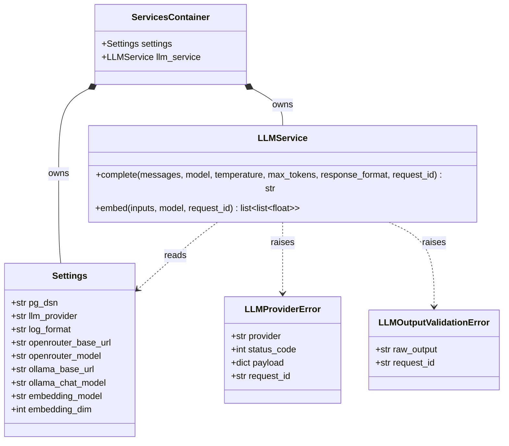

# Task 1 — Foundations (REASONS Canvas, trainee edition)

> **Trainee-edition posture.** This is the canvas you receive on
> Day 1 of Week 1. It is intentionally **under-specified** in places —
> the missing detail is the work you are expected to do during your
> analysis-step + canvas-completion practice. The destination state
> for this task lives in `Task_1_Foundations.md`; do not read that
> file until your mentor signs off this canvas. Sections you must
> complete before generating code are marked **TODO(trainee)**.
>
> **Maps to:** Learning Plan Week 1 — *Python Foundations & Service Abstractions*.
> **Depends on:** `Task_0_Environment.md` (already complete and identical
> to the destination version).
> **Unblocks:** `Task_2_Ingestion.trainee.md`, `Task_3_Orchestration.trainee.md`.

---

## Requirements

### Analysis context

**Domain keywords scanned:** LLMService, OpenRouter, Ollama,
embeddings, settings, request_id, structured logging, retries.
**Existing artifacts:** `.env.example`, the `app/` skeleton from
Task 0. **Prior tasks read:** Task 0 (env keys, healthz, settings
stub).

**Strategic direction:** one provider-agnostic facade over chat +
embeddings, configured by `Settings`. Retries and structured-output
parsing live behind the facade, never in the caller. Errors are
typed so callers can decide policy without sniffing message
strings.

**Risks noticed.**

1. **Unbounded retries cause rapid token / cost drain.** Without a hard
   cap on retry attempts, a flapping provider triggers repeated calls
   that burn tokens and latency budget with no upper bound.
   *Mitigation:* do not expose a `max_retries` parameter; hard-code a
   fixed maximum of 3 attempts behind the facade, applying exponential
   backoff and retrying only on transient failures (HTTP 5xx,
   `httpx.TimeoutException`, `httpx.RequestError`), then raise
   `LLMProviderError`.
2. **Unstructured LLM responses break the LLM-to-program boundary.**
   If `complete()` output is not parsed and validated into a known
   shape, the contract between the agent and downstream deterministic
   code fractures at runtime.
   *Mitigation:* parse every structured output through a Pydantic model
   behind the facade; on a parse failure raise `LLMOutputValidationError`
   carrying the raw output, with no silent fallback.
3. **Missing `request_id` within a single transaction breaks log
   correlation.** If the id is not propagated across the call chain,
   logs cannot be stitched back into one end-to-end trace.
   *Mitigation:* bind a UUIDv4 `request_id` once via middleware into a
   ContextVar at API ingress; all loggers and service methods read it
   from the ContextVar rather than threading it by hand.
4. **API key leakage in logs.** Secrets such as `OPENROUTER_API_KEY` or
   auth headers written into log records expose credentials.
   *Mitigation:* redact authorization headers and secret fields at the
   logging layer; never log raw provider headers, and truncate prompts
   to 500 chars with a `_truncated: true` flag.
5. **Blurred separation of concerns across layers reduces
   maintainability.** Without clear boundaries between config, the HTTP
   client, the service facade, and callers, the code becomes hard to
   reason about and test.
   *Mitigation:* enforce layered ownership — `Settings` owns config,
   `LLMHTTPClient` owns transport, `LLMService` owns provider logic and
   retries — wired together by constructor-based DI in
   `ServicesContainer`.

### Why this task exists

The agent needs **one place** that knows how to talk to LLMs and
**one place** that knows how to read configuration. Without these
abstractions, every retrieval/synthesis/evaluation script would
couple itself directly to OpenRouter or Ollama, which makes the
codebase impossible to test, reason about, or swap providers in.
Task 1 also introduces the structured-logging contract that
everything downstream depends on for observability and request
correlation.

### Acceptance criteria (Given/When/Then)

These are the contract; do not soften them.

- **Given** valid env variables in `.env`,
  **when** `python -c "from app.core.config import get_settings;
  print(get_settings().openrouter_model)"` runs,
  **then** it prints the configured model name without raising.
- **Given** `LLM_PROVIDER=openrouter` and a missing
  `OPENROUTER_API_KEY`,
  **when** `get_settings()` is called,
  **then** Pydantic raises a `ValueError` from the `model_validator`
  naming the missing key. (Under `LLM_PROVIDER=ollama` the key is
  optional.)
- **Given** an `LLMService` instance configured for OpenRouter and a
  test that mocks the underlying `httpx.AsyncClient`,
  **when** `await llm.complete(messages=[{"role":"user","content":"hi"}])`
  is invoked,
  **then** the mocked HTTP layer receives a POST to
  `https://openrouter.ai/api/v1/chat/completions`.
- **Given** an `LLMService` instance configured for Ollama and a
  test that mocks the underlying `httpx.AsyncClient`,
  **when** `await llm.complete(...)` is invoked,
  **then** the mocked HTTP layer receives a POST to
  `http://localhost:11434/api/chat` and unwraps `message.content`.
- **Given** an `LLMService` instance configured for OpenRouter and a
  test that mocks the underlying `httpx.AsyncClient`,
  **when** `await llm.embed(inputs=["a", "b"])` is invoked,
  **then** the mocked HTTP layer receives a POST to
  `https://openrouter.ai/api/v1/embeddings`, and the return value is a
  `list[list[float]]` of length 2 unwrapped from `data[].embedding`
  ordered by each item's `index`.
- **Given** an `LLMService` instance configured for Ollama and a
  test that mocks the underlying `httpx.AsyncClient`,
  **when** `await llm.embed(inputs=["a", "b"])` is invoked,
  **then** the mocked HTTP layer receives a POST to
  `http://localhost:11434/api/embed` with an `input` list, and the
  return value is a `list[list[float]]` of length 2 unwrapped from the
  response `embeddings` field, in input order.
- **Given** an embedding response whose vector length does not match
  `Settings.embedding_dim` (768),
  **when** `LLMService.embed` parses it,
  **then** it raises `LLMProviderError` rather than returning a
  mis-dimensioned vector that would later break the `vector(768)` column.
- **Given** a transient HTTP 5xx response,
  **when** `LLMService.complete` runs,
  **then** the call retries with exponential backoff up to **3
  attempts** before raising `LLMProviderError`.
- **Given** any service or LangGraph node logs a structured event,
  **when** `LOG_FORMAT=json`,
  **then** every record contains at minimum `timestamp`, `level`,
  `request_id`, `event`, and (where applicable) `duration_ms`.

---

## Entities

| Entity                     | Spec                                                                                                    |
| -------------------------- | ------------------------------------------------------------------------------------------------------- |
| `Settings`                 | Pydantic Settings model for the env keys listed in Root Architecture.                                   |
| `LLMService`               | Provider-agnostic facade. Two methods: `complete` (chat) and `embed` (batch embeddings).                |
| `LLMProviderError`         | Custom exception. Carries `provider`, `status_code`, `payload`, `request_id`.                           |
| `LLMOutputValidationError` | Custom exception raised when a structured-output parse fails. (Used in Task 4 but defined here.)        |
| `request_id`               | UUIDv4. Generated by middleware. Threaded into every log line.                                          |
| `ServicesContainer`        | Plain dataclass that bundles `Settings` + `LLMService`. Constructed once in `app/api/main.py` lifespan. |

### Class diagram



---

## Approach

### Design decisions

1. **Single `Settings` class** with a Pydantic `model_validator`
   that raises early when required env keys are missing. No
   per-module env reads scattered through the codebase.
2. **One `LLMService` facade** with two methods (`complete`,
   `embed`). Provider differences (Ollama vs OpenRouter) live
   *inside* the service; callers never see them.
3. **A thin HTTP layer** (`LLMHTTPClient` wrapping
   `httpx.AsyncClient`) so tests can swap in `httpx.MockTransport`
   without monkey-patching the whole network stack.
4. **Typed exceptions** (`LLMProviderError`,
   `LLMOutputValidationError`) so callers branch on type, not on
   error-string parsing.
5. **Structured logging via ContextVar.** A `request_id`
   middleware binds the id once at API ingress; loggers read from
   the ContextVar. No threading the id through every function
   signature.

### Trade-offs accepted

1. we accept a fixed 3-attempt retry budget because it bounds provider cost and latency, even though some transient outages may recover after the final attempt.
2. we accept stricter Pydantic validation because configuration errors should fail fast at startup, even though developers must provide complete local env values before running the app.
3. we accept structured JSON logging because request correlation matters for debugging production flows, even though it creates more verbose log records than plain text logs.
4. we accept failing on invalid structured LLM output because downstream code needs a reliable contract, even though the LLM may occasionally produce recoverable but malformed responses.

---

## Structure

### File layout

```
app/
├── core/
│   ├── config.py             # Settings + get_settings()
│   ├── logging.py            # configure_logging + bind_request_id
│   ├── exceptions.py         # LLMProviderError, LLMOutputValidationError
│   └── services_container.py # ServicesContainer dataclass
├── services/
│   ├── llm_client.py         # LLMHTTPClient (httpx wrapper)
│   └── llm_service.py        # LLMService (provider switch)
└── api/
    └── main.py               # lifespan wires the container; /readyz added here
```

### Method signatures (the contract)

```python
# app/core/config.py
class Settings(BaseSettings):
    pg_dsn: str
    llm_provider: Literal["ollama", "openrouter"] = "ollama"
    log_format: Literal["json", "text"] = "text"
    # Conditional, see Acceptance Criteria
    openrouter_api_key: str | None = None
    openrouter_base_url: str = "https://openrouter.ai/api/v1"
    openrouter_model: str = "gpt-4.1-mini"
    # Defaulted
    ollama_base_url: str = "http://localhost:11434"
    ollama_chat_model: str = "gemma3:27b"
    ollama_ops_model: str = "qwen3.5:4b"
    embedding_model: str = "nomic-embed-text"
    embedding_dim: int = 768

@lru_cache
def get_settings() -> Settings: ...

# app/services/llm_service.py
class LLMService:
    def __init__(self, settings: Settings, http_client: LLMHTTPClient) -> None: ...
    async def complete(
        self,
        messages: list[dict[str, str]],
        *,
        model: str | None = None,
        temperature: float = 0.0,
        max_tokens: int | None = None,
        response_format: str | None = None,
        request_id: str | None = None,
    ) -> str: ...
    async def embed(
        self,
        inputs: list[str],
        *,
        model: str | None = None,
        request_id: str | None = None,
    ) -> list[list[float]]: ...
```

---

## Operations (strict execution order)

> The first 4 steps are pinned. Steps 5+ are **TODO(trainee)** —
> derive them from the Acceptance Criteria + your Approach. Your
> mentor will sign off the full Operations list before you generate
> code.

1. **Replace the Task 0 `Settings` stub** in `app/core/config.py`
   with the full Pydantic Settings model from *Structure*. Add the
   `@lru_cache` factory.
2. **Implement `app/core/logging.py`** with `configure_logging` and
   `bind_request_id`. Read formats from `Settings.log_format`.
3. **Implement `app/core/exceptions.py`** with the two exception
   classes. They must serialise their `payload` safely if printed.
4. **Implement `app/services/llm_client.py`** wrapping
   `httpx.AsyncClient`. The constructor accepts `base_url`, `api_key`,
   and an optional `transport` so tests can inject
   `httpx.MockTransport`.

5. **Implement `LLMService` for both providers.** Route `complete`
   and `embed` from `Settings.llm_provider`, unwrap each provider's
   response shape, retry HTTP 5xx/timeouts/request errors up to 3
   attempts with exponential backoff, then raise `LLMProviderError`.
6. **Wire `ServicesContainer` in `app/api/main.py` and add `/readyz`.**
   Build `Settings`, logging, `LLMHTTPClient`, and `LLMService` in
   lifespan. Add request-id middleware that binds `X-Request-Id` or a
   new UUIDv4 and echoes it on the response.
7. **Write focused tests.** Cover config validation, provider endpoints
   and response unwrapping with `httpx.MockTransport`, bounded retries,
   JSON log fields, request_id injection, secret redaction, and prompt
   truncation.
8. **Update `README.md`** with a *Local development* section that
   covers `poetry install`, the canonical Ollama path (`ollama pull
   …`), and how to run `pytest` + `mypy --strict`. The destination
   README's *Local development* section is a useful reference *after*
   you draft yours.
9. **Verify** by running `pytest`, `ruff check .`, `mypy --strict
   --explicit-package-bases app data_pipelines`, and
   `./scripts/smoke.sh` (the script exists from Task 3+; until then,
   manually `curl /healthz` and `curl /readyz`).

---

## Norms

- Constructor-based DI only. No global singletons.
- All new functions are type-hinted; `mypy --strict` passes.
- Async by default for I/O paths.
- Pydantic v2 for all DTOs.
- Structured logging carries `request_id` on every record.
- Public service methods (`complete`, `embed`) declare
  `request_id: str | None = None`. The default `None` is
  resolved to the ContextVar's bound value at log time, never
  logged as `null`. Safeguard 4 below forbids *bypassing* the
  ContextVar by inventing ad-hoc kwargs; it does NOT forbid the
  documented `request_id` parameter.
- Truncate prompts in logs at 500 chars with a `_truncated: true`
  flag.

---

## Safeguards

1. **Do not import `os.getenv` outside `app/core/config.py`.**
   Every other module reads from a `Settings` instance.
2. **Do not silently swallow LLM errors.** Retries are bounded and
   the final failure raises `LLMProviderError` with the upstream
   payload.
3. **Do not log the `OPENROUTER_API_KEY`** or any header that
   contains it. Redact at the logging layer.
4. **Do not bypass `bind_request_id`** by passing `request_id`
   through arbitrary kwargs. The ContextVar is the canonical
   carrier.
5. **Do not commit a real API key.** `.env` is gitignored;
   `.env.example` ships placeholders only.

---

> **Spec drift watch.** When your implementation diverges from this
> canvas (e.g. you discover the LLM client needs a `timeout`
> parameter that wasn't documented), edit this canvas FIRST in the
> same PR — that's the project's *SPDD discipline* norm. A code-only
> diff with stale specs is a review block.
