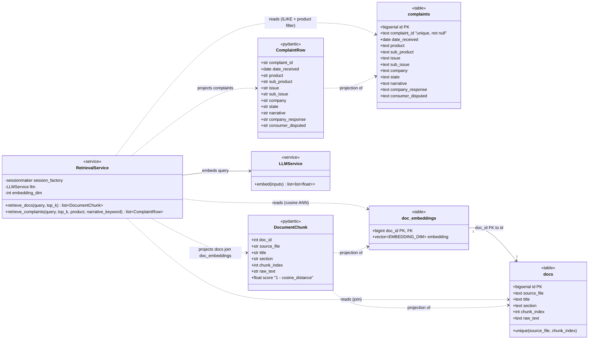

# Task 2 — Ingestion (REASONS Canvas, trainee edition)

> **Trainee-edition posture.** This is the canvas you receive on
> Day 1 of Week 2. Sections you must complete before generating
> code are marked **TODO(trainee)**. Do not consult
> `Task_2_Ingestion.md` (the destination state) until your mentor
> signs off this canvas.
>
> **Maps to:** Learning Plan Week 2 — *Retrieval-Augmented
> Generation, the Naive Way*.
> **Depends on:** `Task_1_Foundations.trainee.md` (LLMService + Settings).
> **Unblocks:** `Task_3_Orchestration.trainee.md`.

---

## Requirements

### Analysis context

**Domain keywords scanned:** RAG, fixed-size chunking, embeddings,
pgvector ANN search, CFPB complaints CSV, ILIKE filter,
narrative_keyword. **Existing artifacts:**
`data/samples/complaints_sample.csv`,
`data/raw_docs/*.txt`, the `LLMService.embed` method (Task 1).
**Prior tasks read:** Tasks 0–1.

**Strategic direction:** ship the *naive* RAG path first. Fixed-size
chunks, raw column values, single-keyword ILIKE on narrative.
The naivety is intentional and **pedagogical**: a later task will
quantify how naive it is by running an evaluation that reveals
the data weaknesses. Resist the urge to over-engineer here.

**Risks noticed.** These are failure modes I actively guard against
(distinct from the *Trade-offs accepted* below, which are deliberate
simplifications whose cost I own — a Risk is something that could
silently go wrong or bite a downstream task, plus its mitigation).

1. **The retrieval interface is load-bearing for Task 3.**
   `retrieve_docs` / `retrieve_complaints` are the contract every
   later week calls; a signature change ripples into the LangGraph
   nodes. *Mitigation:* freeze the signatures in *Method signatures*
   now (including the deliberately-unused `query` and the
   `request_id` carrier), and gate any future change behind the SPDD
   canvas-first norm rather than editing code ad hoc.

2. **Embedding-dim mismatch silently poisons the vector store.**
   The schema hard-codes `vector(EMBEDDING_DIM)`; if the ingest run
   ever emits vectors of a different width than `Settings.embedding_dim`
   (wrong model pulled, config drift), pgvector may reject the insert
   — or worse, a mixed-dimension table makes cosine search meaningless.
   *Mitigation:* `apply_schema` substitutes the single
   `/* EMBEDDING_DIM */` source of truth, and the ingest path
   hard-fails at insert time on any dimension ≠ `Settings.embedding_dim`
   (Norms) rather than writing a bad row.

3. **Duplicate `complaint_id`s in the starter sample cause silent
   row loss.** The CSV carries ~600 duplicate `complaint_id`s (1,000
   rows → ~400 unique); a plain INSERT would either crash on the
   unique constraint or, with `ON CONFLICT DO NOTHING`, silently drop
   rows and leave the trainee thinking 1,000 landed. *Mitigation:*
   idempotent `UPSERT` on `complaint_id` plus a surfaced warning log
   of the dedup count (Safeguard 4), so the 1,000→~400 collapse is
   visible, not hidden.

4. **The `narrative` column carries CFPB PII-redaction tokens.**
   Narratives contain `XXXX` redaction markers and free-text that may
   reference sensitive detail; naively logging full rows during
   ingest could leak them, and "cleaning" the `XXXX` tokens would
   corrupt the source. *Mitigation:* treat `XXXX` as opaque strings
   (Constitution — do not reverse-engineer or normalise), and rely on
   the Task-1 logging contract (truncate + redact) — log row counts
   and `complaint_id`s, never full narrative bodies.

### Why this task exists

The agent needs *something* to retrieve from. Tasks 3+ will all
call `RetrievalService.retrieve_docs` and
`RetrievalService.retrieve_complaints`; this task ships those two
methods backed by Postgres + pgvector. The naive shape is the
deliberate choice: a later week will measure its faults and
decide whether to upgrade.

### Acceptance criteria (Given/When/Then)

- **Given** a fresh `complaints` table and the starter CSV at
  `data/samples/complaints_sample.csv`,
  **when** `python -m data_pipelines.ingest_tables.ingest_public_data`
  runs,
  **then** the table contains one row per unique `complaint_id`
  from the CSV, with all CFPB columns populated and no NULL
  `complaint_id`.
- **Given** a fresh `docs` + `doc_embeddings` schema and the three
  starter `.txt` files,
  **when** `python -m data_pipelines.ingest_docs.embed_starter_docs`
  runs,
  **then** every chunk is present in `docs` and every chunk has a
  matching embedding row in `doc_embeddings` with the right vector
  dimension.
- **Given** a populated corpus,
  **when** `RetrievalService.retrieve_docs(query="overdraft fee",
  top_k=3)` is called,
  **then** it returns at most 3 `DocumentChunk` records, sorted by
  cosine distance ascending.
- **Given** a populated corpus,
  **when** `RetrievalService.retrieve_complaints(query="late fee",
  product="Credit card", narrative_keyword="late fee")` is
  called,
  **then** it returns up to 10 `ComplaintRow` records that match
  the filters (ILIKE on `narrative` for the keyword), sorted by
  `date_received` desc.

---

## Entities

| Entity                     | Spec                                                                                                     |
| -------------------------- | -------------------------------------------------------------------------------------------------------- |
| `complaints_sample.csv`    | Existing read-only artifact at `data/samples/`.                                                          |
| `raw_docs/*.txt`           | Three existing read-only artifacts. Each contains 2 sections delimited by lines containing `--- 8< ---`. |
| `complaints` table         | Postgres table mirroring the CSV columns. SQL in Root Architecture.                                      |
| `docs` table               | One row per chunk. `source_file`, `title`, `section`, `chunk_index`, `raw_text`.                         |
| `doc_embeddings` table     | One row per chunk; `embedding vector(EMBEDDING_DIM)`.                                                    |
| `DocumentChunk` (Pydantic) | App-side projection of `docs` ⨝ `doc_embeddings`.                                                        |
| `ComplaintRow` (Pydantic)  | App-side projection of `complaints`.                                                                     |
| `RetrievalService`         | Two methods only: `retrieve_docs`, `retrieve_complaints`.                                                |

### Class diagram



> **Design notes.** `retrieve_docs` reads `docs ⨝ doc_embeddings` via
> cosine ANN (`embedding <=> query_vec`) and therefore depends on
> `LLMService.embed` to vectorise the query; `retrieve_complaints`
> reads `complaints` with an `ILIKE` narrative filter + exact `product`
> match and needs no embedding. Both project raw rows into Pydantic
> DTOs (`ComplaintRow` / `DocumentChunk`) before returning — never raw
> SQLAlchemy rows. `DocumentChunk` carries `doc_id` so retrieved chunks
> stay traceable (feeds `FeedbackEvent.retrieved_doc_ids` in a later
> task); `score = 1 - cosine_distance` is the v0 similarity contract.

---

## Approach

### Design decisions

1. **Fixed-size chunking, not section-aware.** Split each `.txt`
   file into ~600-character chunks with ~100-character overlap.
   Yes, this ignores the `--- 8< ---` markers. Yes, that's the
   point. (Character splitting, not tokenizer-based; we want
   the chunker readable in 10-20 lines of Python.)
2. **Single-keyword ILIKE filter.** `retrieve_complaints` accepts
   one optional `narrative_keyword: str` — a single literal
   substring. No multi-keyword OR. No regex.
3. **Cosine distance ANN.** `retrieve_docs` runs
   `ORDER BY embedding <=> :query_vec` on `doc_embeddings`.
   `k` defaults to 5.
4. **One ingest entrypoint per corpus.**
   `data_pipelines/ingest_tables/ingest_public_data.py` for the CSV;
   `data_pipelines/ingest_docs/embed_starter_docs.py` for the docs.
   Both are idempotent (`UPSERT` on `complaint_id`; `DELETE+INSERT`
   on `(source_file, chunk_index)`).
5. **Service constructed in `app/api/main.py` lifespan.** Same
   pattern as `LLMService` from Task 1. Stored on
   `app.state.services.retrieval`.

### Trade-offs accepted

1. **Fixed-size character chunking over section-aware chunking.**
   We accept fixed 600-char/100-overlap chunking because it is
   readable in ~15 lines and ships the naive path immediately (a
   trade-off already accepted in the Constitution's *Trade-offs we
   accept knowingly*), even though it ignores the `--- 8< ---`
   section markers and will split questions, answers, and `Tip:`
   callouts mid-thought — degrading retrieval recall. This cost is
   deliberate: Task 5 measures it, Task 6 fixes it.

2. **Single-keyword `ILIKE` over PostgreSQL full-text search.**
   We accept a single literal `ILIKE '%keyword%'` substring filter
   on `narrative` because it is trivial to implement and fast enough
   on a 1k-row corpus, even though it triggers a full table scan, is
   case/substring-literal only (no stemming or tokenisation, so
   "late fee" will not match "overdue charge"), and would not scale.
   Full-text search (`tsvector`) is explicitly out of scope this week.

3. **768-dim local embeddings over 1536-dim hosted embeddings.**
   We accept `nomic-embed-text` (768-dim) because it runs locally on
   Ollama at zero cost and no external billing surface (the
   Constitution's canonical-provider trade-off), even though a
   1536-dim hosted model (e.g. OpenAI via OpenRouter) may retrieve
   with higher quality, and switching models is a destructive schema
   change — the pgvector column type is immutable, so it requires a
   `DROP TABLE doc_embeddings; CREATE TABLE …` migration in the same
   commit as the `EMBEDDING_DIM` change.

4. **Idempotent UPSERT over plain INSERT.**
   We accept `UPSERT` on `complaint_id` (and `DELETE+INSERT` on
   `(source_file, chunk_index)`) because it makes both ingest scripts
   safely re-runnable — re-running the CSV does not double-count, and
   the ~600 duplicate `complaint_id` rows in the starter sample
   (1,000 rows → ~400 unique) collapse cleanly with a surfaced
   warning count — even though it is more complex than a plain INSERT
   and re-embeds every chunk on each re-run, costing time and tokens.


---

## Structure

### File layout

```
data_pipelines/
├── ingest_tables/
│   ├── __init__.py
│   └── ingest_public_data.py     # CSV -> complaints table
├── ingest_docs/
│   ├── __init__.py
│   └── embed_starter_docs.py     # txt -> docs + doc_embeddings
├── schema/
│   └── 0001_create_tables.sql    # complaints, docs, doc_embeddings, pgvector
└── starter_corpus.py             # shared chunking + parsing helpers

app/services/
├── retrieval_service.py          # RetrievalService class
└── ...

app/core/
├── db.py                         # SQLAlchemy session factory; reads PG_DSN
└── ...
```

### Method signatures (the contract)

```python
# app/core/db.py
def make_engine(dsn: str) -> Engine: ...
def get_sessionmaker(engine: Engine) -> sessionmaker[Session]: ...
def ensure_pgvector_extension(engine: Engine) -> None: ...
def apply_schema(engine: Engine, sql_path: Path, *, embedding_dim: int) -> None: ...

# app/services/retrieval_service.py
class RetrievalService:
    def __init__(
        self,
        session_factory: sessionmaker[Session],
        llm: LLMService,
        *,
        embedding_dim: int,
    ) -> None: ...

    async def retrieve_docs(
        self,
        query: str,
        *,
        top_k: int = 5,
        request_id: str | None = None,
    ) -> list[DocumentChunk]: ...

    async def retrieve_complaints(
        self,
        query: str,
        *,
        top_k: int = 10,
        product: str | None = None,
        narrative_keyword: str | None = None,
        request_id: str | None = None,
    ) -> list[ComplaintRow]: ...
```

> The `narrative_keyword: str | None` (singular, optional) shape is
> the v0 contract. **Do not change it.** Future tasks may evolve
> this signature; that evolution must follow the project's *SPDD
> discipline* norm (canvas first, then code), and is out of scope
> for this Task.
>
> The `query: str` parameter on `retrieve_complaints` is part of
> the v0 contract but is NOT used for filtering or ranking in v0.
> It is reserved for the v1 evolution path (a future task may add
> embedding-based complaint ranking). Log it; do not branch on
> it. Tests should not assert that `query` changes the result
> set.
>
> The `request_id: str | None = None` argument is the carrier for
> the structured-logging contract Task 1 introduced — every public
> service method takes one so the caller can propagate the ID
> without it leaking through arbitrary kwargs.

---

## Operations (strict execution order)

> The first 3 steps are pinned. The remaining steps are derived from
> the Approach. Tests are interleaved with the implementation they
> exercise (TDD) rather than batched at the end: the chunker test
> follows the chunker, and the `retrieve_*` tests are written *before*
> `RetrievalService` so the implementation is driven to green. Your
> mentor will sign off the full Operations list before you generate
> code.

1. **Apply the schema** in
   `data_pipelines/schema/0001_create_tables.sql`. Make it idempotent
   (`CREATE … IF NOT EXISTS`) so re-running is safe.
2. **Implement `app/core/db.py`** with the four helpers in
   *Method signatures*: `make_engine`, `get_sessionmaker`,
   `ensure_pgvector_extension`, and `apply_schema`. The
   `apply_schema` helper substitutes a `/* EMBEDDING_DIM */`
   placeholder so the same SQL works for both 768-d and 1536-d
   embeddings.
3. **Implement `data_pipelines/starter_corpus.py`** with a chunker
   helper (fixed-size with overlap) and a CSV reader that yields
   `dict`s in the canonical column order.
4. **Test the chunker.** Unit test for the fixed-size/overlap
   chunker — no I/O, pure function, so it locks the chunking
   behaviour immediately after step 3 (empty input, sub-chunk-size
   input, overlap boundary).
5. **Implement
   `data_pipelines/ingest_tables/ingest_public_data.py`** with an
   idempotent UPSERT on `complaint_id`. Surface a warning log with
   the dedup count (the starter sample carries duplicate
   `complaint_id`s — Safeguard 4).
6. **Implement
   `data_pipelines/ingest_docs/embed_starter_docs.py`** that
   chunks and embeds, then writes both `docs` and `doc_embeddings`
   in one transaction per file.
7. **Write the `retrieve_*` tests first (TDD).** A SQL-shape test
   for each `retrieve_*` method using a fixture loaded into the test
   DB. These are written *before* step 8 and are expected to fail
   until `RetrievalService` exists. Cover the two retrieval
   acceptance criteria (cosine-ascending `top_k` for docs;
   `ILIKE` + `product` filter, `date_received` desc for complaints).
8. **Implement `RetrievalService`** for both methods, driving the
   step-7 tests to green. Use SQLAlchemy `text()` with bound params;
   never string-format SQL. Return typed Pydantic projections, never
   raw SQL rows.
9. **Wire `RetrievalService` into `ServicesContainer`** (extend the
   dataclass from Task 1; construct once in the `app/api/main.py`
   lifespan, never ad hoc elsewhere).
10. **Update `README.md` *Data prep* section** with the two ingest
    commands plus the `complaints` row count and `docs` chunk count
    you observe after a fresh run. Drop a one-line "what you'll see"
    so a fresh trainee knows the expected scale.
11. **Verify** by running `pytest`, `ruff`, `mypy --strict`, and
    a manual `python -c "import asyncio; from app.api.main import …;
    print(asyncio.run(svc.retrieve_docs('overdraft', top_k=3)))"`.

---

## Norms

- All SQL goes through `text(...)` with bound parameters.
- Ingest scripts log every step (`event="ingest_csv_row"`,
  `event="embed_chunk"`, etc.) with row counts and durations.
- Both ingest scripts are idempotent.
- `RetrievalService` returns *typed* projections, never raw SQL
  rows.
- Embedding dim must equal `Settings.embedding_dim`. A mismatch
  is a hard fail at insert time.

---

## Safeguards

1. **No alternate vector store.** pgvector only.
2. **No alternate database.** Postgres only.
3. **No live CFPB scraping.** The starter CSV is the entire
   corpus.
4. **No silent dedup loss.** If two CSV rows share a
   `complaint_id`, `UPSERT` keeps the last; surface a warning log
   so the trainee sees the dedup count.
5. **No mutation of `data/samples/` or `data/raw_docs/`.** Read
   only.

---

> **Spec drift watch.** When your implementation diverges from
> this canvas (e.g. you find that the chunker needs to handle a
> trailing-whitespace case the spec didn't mention), edit this
> canvas FIRST in the same PR.
