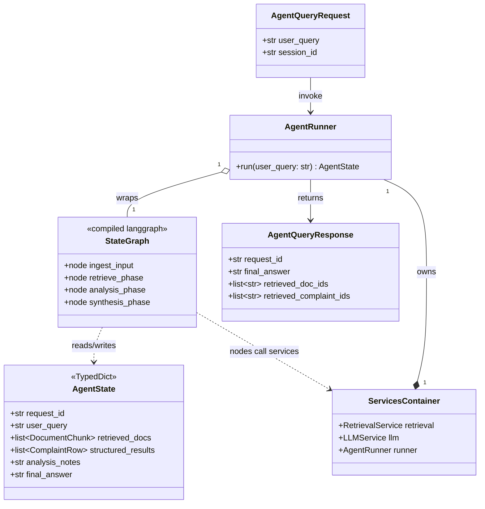
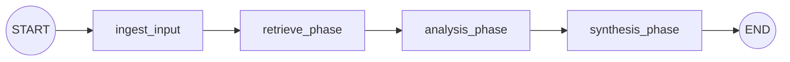

# Task 3 — Orchestration (REASONS Canvas)

> **Maps to:** Learning Plan Week 3 — *LangGraph Agent Skeleton & State*.
> **Depends on:** `Task_1_Foundations.md`, `Task_2_Ingestion.md`.
> **Unblocks:** `Task_4_Prompts.md`, `Task_5_Evaluation.md`.
>
> **Note on graph topology:** Task 3 ships a strictly linear graph
> (`ingest_input → retrieve_phase → analysis_phase → synthesis_phase`).
> Task 6 *inserts* `scenario_phase` *before* `retrieve_phase` so the
> scenario-driven structured retrieval can condition on intent (this
> evolution is a v1-only concern; the v0 baseline ignores the
> scenario). Task 7 *extends* the graph with `safety_phase`
> (pre-retrieval gate), `refusal_phase` (terminal node when safety
> blocks), and `complaint_letter_phase` (sub-task A in Task 8). When
> reading the code in `app/core/graph.py` against this canvas, treat
> those extra nodes as Task 6/7/8 deltas, not drift from Task 3.

---

## Requirements

### Analysis context

**Domain keywords scanned:** LangGraph, StateGraph, AgentState,
nodes, edges, retrieve, analyse, synthesise, /agent/query.
**Existing artifacts:** `LLMService` (Task 1), `RetrievalService`
(Task 2). **Prior tasks read:** Tasks 0–2 in full.

**Strategic direction:** one TypedDict (`AgentState`) flows
through a linear four-node graph (`ingest_input → retrieve_phase →
analysis_phase → synthesis_phase`). Branching, scenario routing,
and safety nodes are Task 6+ concerns; this Task ships the
plumbing only. Pure-ish nodes (return partial state) so each can
be unit-tested in isolation.

**Risks noticed:** (1) AgentState reducer ordering matters — if
two nodes both write `retrieved_docs`, the merge has to be
explicit; we sidestep by making each writer responsible for one
field family; (2) FastAPI's lifespan must construct the
`AgentRunner` *once*, not per request, otherwise LangGraph
re-compiles on every call; (3) the `/agent/query` HTTP error
contract is now load-bearing for Task 5's eval batch — 500 vs 502
must be deterministic.

### Why this task exists

The agent must move from "a pile of services" to a **state machine**
with explicit phases. LangGraph gives the team a visible, debuggable
flow: ingest → retrieve → analyse → synthesise. Without this, every
incoming question would short-circuit either into a single LLM call
(no grounding) or into ad-hoc orchestration code that cannot be tested
or traced.

### Acceptance criteria (Given/When/Then)

- **Given** the FastAPI app is running and Postgres has the Task 2
  ingest applied,
  **when** a developer issues
  ```bash
  curl -X POST http://localhost:8000/agent/query \
      -H "Content-Type: application/json" \
      -d '{"question":"My bank charged an overdraft fee but my account never went negative"}'
  ```
  **then** the response contains a non-empty `final_answer` string and
  a non-empty `retrieved_doc_ids` array, and the response header
  `X-Request-Id` is set.
- **Given** a query whose retrieval phase returns zero documents,
  **when** the graph runs,
  **then** `final_answer` is non-empty, the `error` field is `null`,
  and the response explicitly states that no relevant grounding was
  found (i.e. the agent does not hallucinate citations).
- **Given** the underlying `LLMService.complete` raises
  `LLMProviderError` mid-graph,
  **when** the graph runs,
  **then** the API returns HTTP 502 with body
  `{"error_code":"llm_provider_error","message":"...","request_id":"..."}`.
- **Given** unit tests with a stubbed `LLMService` that returns canned
  text and a stubbed `RetrievalService` that returns canned
  `DocumentChunk`/`ComplaintRow` lists,
  **when** the graph is invoked synchronously in-process,
  **then** the resulting `AgentState` contains populated
  `retrieved_docs`, `structured_results`, `analysis_notes`, and
  `final_answer`, and tests run in under 2 seconds.

### Explicit non-goals for this task

- No prompt templates. Inline prompt strings here are tolerated *only*
  inside the four nodes; Task 4 replaces them with Jinja templates.
- No `Scenario` extraction (Task 4).
- No safety guardrails (Task 7) — this Task may add a no-op
  `safety_decision` field to `AgentState` but must not enforce it.
- No tracing instrumentation (Task 5).

---

## Entities

| Entity | Spec |
|---|---|
| `AgentState` | The single TypedDict that flows between nodes. Field list lives in Root Architecture; this Task is the **first place the runtime AgentState is implemented**. |
| `DocumentChunk` | Defined in Task 2; re-exported from `app/core/state.py` here. |
| `ComplaintRow` | Defined in Task 2; re-exported from `app/core/state.py` here. |
| Graph nodes | `ingest_input`, `retrieve_phase`, `analysis_phase`, `synthesis_phase`. |
| `ServicesContainer` | Already from Task 1. Now also carries `retrieval` (added in Task 2). |
| `AgentRunner` | Thin wrapper around the compiled LangGraph runnable. Provides `await runner.run(user_query: str, *, session_id, conversation_history) -> AgentState`. |
| `AgentQueryRequest` / `AgentQueryResponse` | Pydantic request and response models for `POST /agent/query`. |

### Graph + class diagram

The first half is the graph topology (the StateGraph LangGraph
compiles); the second half is the class collaboration around it.



Graph topology (the `StateGraph` edges this Task ships):



---

## Approach

### Design decisions

1. **State is a TypedDict.** Pydantic is reserved for DTOs at API
   boundaries and for structured LLM outputs. State is internal and
   benefits from being lightweight and TypedDict-friendly with
   LangGraph's reducer model.
2. **Pure-ish node functions.** Each node takes `AgentState` and
   returns a partial `AgentState` (a dict of *new* fields). Nodes do
   not mutate the input.
3. **Linear graph in v0.** `START → ingest_input → retrieve_phase →
   analysis_phase → synthesis_phase → END`. Branching (e.g. for
   different `Scenario.issue_type`) is deferred to Task 8.
4. **Retrieval phase calls both retrieval methods concurrently** with
   `asyncio.gather`, falling back to sequential if one raises. Both
   results land in state; the analysis phase decides what to use.
5. **Analysis phase uses an inline prompt** that is short and
   bracketed by markers like `<facts>` / `<question>`. Task 4 replaces
   it with `doc_summary.j2`.
6. **Synthesis phase emits the user-facing answer** with explicit
   instructions to cite by listing relevant `complaint_id` and
   `(source_file, chunk_index)` references. Task 4 will refine the
   wording.
7. **`AgentRunner` is constructed once at app startup** and stored on
   `ServicesContainer.runner`. Per-request invocation is just a method
   call.

### Trade-offs accepted

- Inline prompts in this Task are duplicated when Task 4 lands. Worth
  it: it keeps Task 3 focused on graph plumbing without dragging
  Jinja2 in.
- Concurrent retrieval can mask which corpus drove an answer. The
  tracing in Task 5 will fix that; for now the logs include both
  result counts.
- One retry for `LLMService` exhaustion is at the service layer, not
  the node layer. Nodes do not implement their own retries.

---

## Structure

### Files this task creates or amends

```text
app/
├── core/
│   ├── state.py                        # CREATE
│   ├── graph.py                        # CREATE
│   └── services_container.py           # AMEND (add `runner: AgentRunner`)
├── tools/
│   ├── retrieve_docs_tool.py           # CREATE
│   ├── retrieve_structured_tool.py     # CREATE
│   ├── summarise_tool.py               # CREATE
│   └── synthesise_answer_tool.py       # CREATE
└── api/
    └── main.py                         # AMEND (add /agent/query)
tests/
├── test_state.py                       # CREATE
├── test_tools.py                       # CREATE
├── test_graph.py                       # CREATE
├── test_agent_query_endpoint.py        # CREATE
└── fixtures/
    ├── llm_responses/
    │   ├── analysis_notes_ok.txt       # CREATE
    │   └── final_answer_ok.txt         # CREATE
    └── retrieval/
        ├── overdraft_chunks.json       # CREATE
        └── credit_card_complaints.json # CREATE
```

### Module shapes

```python
# app/core/state.py
class AgentState(TypedDict, total=False):
    request_id: str
    session_id: str | None
    user_query: str
    conversation_history: list[dict]
    safety_decision: SafetyDecision | None  # added but unused in Task 3
    retrieved_docs: list[DocumentChunk]
    structured_results: list[ComplaintRow]
    scenario: Scenario | None              # added but unused in Task 3
    analysis_notes: str
    final_answer: str | None
    error: str | None

# app/tools/retrieve_docs_tool.py
async def retrieve_docs_tool(state: AgentState, *, services: ServicesContainer) -> AgentState: ...

# app/tools/retrieve_structured_tool.py
async def retrieve_structured_tool(state: AgentState, *, services: ServicesContainer) -> AgentState: ...

# app/tools/summarise_tool.py
async def summarise_tool(state: AgentState, *, services: ServicesContainer) -> AgentState: ...

# app/tools/synthesise_answer_tool.py
async def synthesise_answer_tool(state: AgentState, *, services: ServicesContainer) -> AgentState: ...

# app/core/graph.py
def build_agent(services: ServicesContainer) -> AgentRunner: ...

class AgentRunner:
    def __init__(self, graph: CompiledStateGraph) -> None: ...
    async def run(
        self,
        *,
        user_query: str,
        session_id: str | None,
        conversation_history: list[dict] | None = None,
        request_id: str | None = None,
    ) -> AgentState: ...
```

### API contract

```python
# app/api/main.py
class AgentQueryRequest(BaseModel):
    question: str = Field(min_length=1, max_length=4000)
    session_id: str | None = None
    conversation_history: list[dict] = Field(default_factory=list)

class AgentQueryResponse(BaseModel):
    request_id: str
    final_answer: str
    retrieved_doc_ids: list[str]      # f"{source_file}#{chunk_index}"
    retrieved_complaint_ids: list[str]
    analysis_notes: str | None = None
    debug: dict | None = None         # only when ?debug=1

@app.post("/agent/query", response_model=AgentQueryResponse)
async def agent_query(payload: AgentQueryRequest, debug: bool = False) -> AgentQueryResponse: ...
```

---

## Operations (strict execution order)

1. **Add LangGraph dependencies** to `pyproject.toml`:
   ```toml
   "langgraph>=0.2,<0.3",
   "langchain-core>=0.3,<0.4",
   ```
   Lockfile updated.
2. **Create `app/core/state.py`** with `AgentState` plus re-exports of
   `DocumentChunk`, `ComplaintRow`. Add forward declarations of
   `Scenario` and `SafetyDecision` as `None`-type placeholders so
   `AgentState` typechecks; the actual classes land in Task 4.
3. **Implement the four tools** in `app/tools/`. Each tool:
   - Reads needed fields from `state`.
   - Calls a service (`services.retrieval` or `services.llm`).
   - Returns a *partial* `AgentState` (only the fields it computes).
   - Logs structured events: `event="retrieve_docs"`,
     `event="summarise"`, etc. with `request_id`, durations, and
     count metrics.
   - Wraps `LLMProviderError` and re-raises (no swallow).
4. **Implement `app/core/graph.py`** with `build_agent`:
   - Instantiate `StateGraph(AgentState)`.
   - Register four nodes that wrap the four tools, partialed with
     `services`.
   - Add edges: `START → ingest_input → retrieve_phase →
     analysis_phase → synthesis_phase → END`.
   - `ingest_input` is implemented inline as a tiny node that just
     ensures `request_id` is on state and stamps an `iso_started_at`
     for logs.
   - Compile and wrap in `AgentRunner`.
5. **Wire `AgentRunner`** into `ServicesContainer` construction in
   `app/api/main.py`'s lifespan.
6. **Add `POST /agent/query`** with the request/response models above.
   On `LLMProviderError`, return HTTP 502; on any other unhandled
   exception, return HTTP 500 with a structured body. Set the response
   header `X-Request-Id`.
7. **Add `?debug=1` support** that returns the full
   `retrieved_docs[].raw_text`, `structured_results[]`, and
   `analysis_notes`. Default off.
8. **Tests.**
   - `test_state.py`: round-trip a fully populated `AgentState` and
     assert TypedDict access works.
   - `test_tools.py`: each tool gets a unit test with stubbed
     services.
   - `test_graph.py`: end-to-end run of the compiled graph using
     stubs that read fixtures from `tests/fixtures/`. Asserts the
     four-field invariants from Acceptance Criteria.
   - `test_agent_query_endpoint.py`: uses FastAPI `TestClient` with
     the lifespan disabled and `services` injected via dependency
     override; covers the happy path, the empty-retrieval path, and
     the LLM-error path.
9. **Update `README.md`** with the curl example and an outline diagram
   of the four-node graph (ASCII art is fine).
10. **Create `scripts/smoke.sh`** as the project's `spdd-api-test`
    equivalent: a fast cURL-based smoke that hits `/healthz`,
    `/readyz`, and `/agent/query` (happy path) and prints PASS / FAIL
    per check. The red-team and feedback checks land in Task 7 when
    those endpoints exist; the script must already be parameterised
    so adding them later is one new function call. Run it as part of
    the local-dev cycle before opening a PR.
11. **Verify** by running the test suite, then `docker compose up
    --build`, then `./scripts/smoke.sh`, then a manual `curl
    /agent/query` with the example payload.

---

## Norms

- LangGraph node functions are coroutine functions.
- All node functions accept `services: ServicesContainer` via a
  partial in `build_agent`. They never instantiate services
  themselves.
- All node logs include `request_id`, `node_name`, and
  `duration_ms`.
- `AgentState` mutations are **always** returned as partial dicts;
  never use `state.update()`.
- Inline prompts in this Task are clearly marked with a leading
  comment `# TODO(Task 4): replace with Jinja template <name>.j2`.
- API request/response models use `model_config = ConfigDict(extra="forbid")`.
- The graph's compiled artifact is cached on `ServicesContainer`; do
  not recompile per request.

---

## Safeguards

### What this task must NOT do

1. **Do not store conversation history in a database.** Caller-supplied
   history flows in via the request body. UI session is the responsibility
   of Task 5/6.
2. **Do not call `RetrievalService` outside `retrieve_phase`.** No
   "just-in-time" retrieval inside synthesis.
3. **Do not implement any safety check.** A no-op `safety_decision`
   field exists on state for Task 7 to populate; this Task sets it
   to `None` and never reads it.
4. **Do not load Jinja templates.** Inline prompts only.
5. **Do not log raw API request bodies at INFO.** They may contain
   user content; log redacted summaries with character counts.
6. **Do not build a streaming endpoint.** Server-sent events are out
   of scope until at least Task 8.
7. **Do not couple the graph to FastAPI.** The graph runs equally well
   from `run_agent_batch.py` (Task 5). Test that contract.
8. **Do not silently degrade on retrieval failure.** A retrieval
   exception bubbles up. An *empty* retrieval result is allowed and
   handled by the synthesis node.
9. **Do not import `langchain.agents` or `langchain` `Runnable`
   helpers.** Stay on the smaller `langgraph` + `langchain-core`
   surface.
10. **Do not skip writing the endpoint test for the LLM-error path.**
    That test catches regressions where exceptions get swallowed by
    LangGraph's executor.

### Error handling specifics

- The `analysis_phase` and `synthesis_phase` must wrap the LLM call in
  a `try/except LLMProviderError` and propagate. They never default
  the `final_answer` to a placeholder.
- If `retrieve_docs` raises while `retrieve_complaints` succeeds (or
  vice versa), the surviving result is preserved on state and the
  failed branch logs a warning. The synthesis node still runs.
- If both retrieval branches fail, the `synthesis_phase` is **not**
  called; the runner returns the state with `error` populated and
  the API translates this to HTTP 502.

### Verification command (printed to user at the end)

```bash
pytest tests/test_state.py tests/test_tools.py \
       tests/test_graph.py tests/test_agent_query_endpoint.py -v
docker compose -f infra/docker-compose.yml up --build
curl -fsS -X POST http://localhost:8000/agent/query \
     -H "Content-Type: application/json" \
     -d '{"question":"My bank charged an overdraft fee but my account never went negative"}'
```
