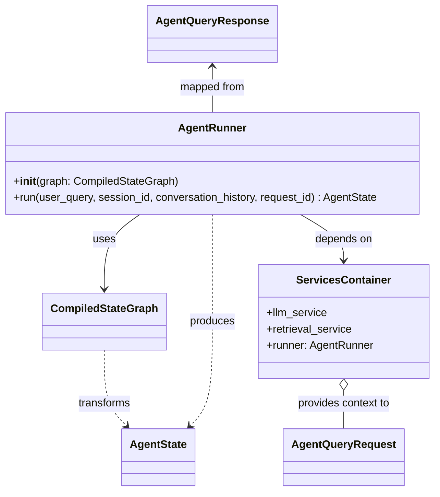
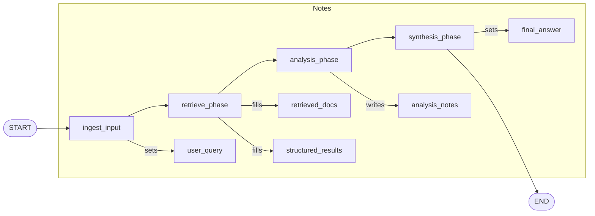

# Task 3 — Orchestration (REASONS Canvas, trainee edition)

> **Trainee-edition posture.** This is the canvas you receive on
> Day 1 of Week 3. Sections marked **TODO(trainee)** are the work
> you complete during the analysis + canvas-completion practice.
> Do not consult `Task_3_Orchestration.md` (the destination state)
> until your mentor signs off this canvas.
>
> **Maps to:** Learning Plan Week 3 — *Agentic Orchestration with
> LangGraph*.
> **Depends on:** `Task_2_Ingestion.trainee.md` (RetrievalService is now
> wired into the container).
> **Unblocks:** `Task_4_Prompts.trainee.md`, `Task_5_Evaluation.trainee.md`.

---

## Requirements

### Analysis context

**Domain keywords scanned:** LangGraph, StateGraph, AgentState,
nodes, edges, retrieve, analyse, synthesise, /agent/query.
**Existing artifacts:** `LLMService` (Task 1),
`RetrievalService` (Task 2). **Prior tasks read:** Tasks 0–2 in
full.

**Strategic direction:** one TypedDict (`AgentState`) flows
through a linear multi-node graph. Pure-ish nodes (return
*partial* state) so each can be unit-tested in isolation.

**Risks noticed.** List **at least three** risks
specific to a multi-node LangGraph application and how your
design handles each. Hint domains: state-merge semantics when two
nodes write the same field, lifespan-vs-per-request graph
compilation, error propagation across node boundaries, the HTTP
status-code contract for `/agent/query`.

- Risk 1 — Conflicting state writes
   - Description: Multiple nodes may write the same `AgentState` field, causing inconsistent or lost values.
   - Mitigation: Enforce single-writer-per-field or a simple merge rule and log any overwrites with `request_id` and `node_name`.

- Risk 2 — Graph compilation timing
   - Description: Compiling the graph once (lifespan) vs per-request is a trade-off between performance and flexibility.
   - Mitigation: Default to lifespan compilation; enable per-request compile only when needed and gate it with a feature flag and benchmarks.

- Risk 3 — Node error propagation
   - Description: Unhandled node errors can crash runs or return wrong HTTP codes.
   - Mitigation: Translate `LLMProviderError` to HTTP 502, other failures to HTTP 500, and have nodes catch recoverable errors and continue when safe.

- Risk 4 — HTTP status-code contract
   - Description: Ambiguous error-to-status mapping makes client behavior unclear.
   - Mitigation: Specify mapping (validation→400, LLM→502, internal→500), require `{"error_code","message","request_id"}` and always set `X-Request-Id`.

### Why this task exists

By the end of this Task, the agent works end-to-end: a single
HTTP request to `POST /agent/query` retrieves evidence,
synthesises a grounded answer, and returns it with retrieved IDs.
Tasks 4–7 will replace the inline strings with prompt templates,
add safety, and ship a UI; this Task ships the plumbing.

### Acceptance criteria (Given/When/Then)

- **Given** the stack is healthy and the corpus is populated,
  **when** `POST /agent/query` is called with a non-empty
  `question`,
  **then** the response contains `request_id`, `final_answer`,
  `retrieved_doc_ids` (`list[str]`), and
  `retrieved_complaint_ids` (`list[str]`); `final_answer` is a
  non-empty string.
- **Given** the same stack,
  **when** the same request is made twice,
  **then** the two responses have **different** `request_id`s.
- **Given** an upstream `LLMProviderError`,
  **when** the synthesis node raises it,
  **then** `/agent/query` returns HTTP 502 with a structured body
  `{"error_code", "message", "request_id"}`.
- **Given** any other unhandled exception during graph execution,
  **when** the graph raises,
  **then** `/agent/query` returns HTTP 500 with the same
  structured body shape, and the response header
  `X-Request-Id` is set on every response (success or error).
- **Given** the graph ran end-to-end,
  **when** logs are collected,
  **then** every log record from a node carries
  `request_id`, `node_name`, and `duration_ms`.

---

## Entities

| Entity | Spec |
|---|---|
| `AgentState` | The single TypedDict that flows between nodes. Field list lives in Root Architecture; this Task is the **first place the runtime AgentState is implemented**. |
| `DocumentChunk` | From Task 2; re-export from `app/core/state.py`. |
| `ComplaintRow` | From Task 2; re-export from `app/core/state.py`. |
| Graph nodes | At minimum: `ingest_input`, `retrieve_phase`, `analysis_phase`, `synthesis_phase`. You may split or rename, but every node must satisfy the partial-state contract from Norms. |
| `ServicesContainer` | From Task 1/2; this Task adds `runner: AgentRunner`. |
| `AgentRunner` | Thin wrapper around the compiled LangGraph runnable. |
| `AgentQueryRequest` / `AgentQueryResponse` | Pydantic models for the endpoint. |

### Graph + class diagram

Below are the Mermaid `classDiagram` and `flowchart` that document the runtime structure and node order for the agent.





---

## Approach

### Design decisions

1. **State is a TypedDict.** Pydantic is reserved for DTOs at API
   boundaries and for structured LLM outputs. State is internal
   and benefits from being lightweight.
2. **Pure-ish node functions.** Each node takes `AgentState` and
   returns a *partial* `AgentState` (a dict of *new* fields).
   Nodes do not mutate the input.
3. **Linear graph for now.** Branching, scenario routing, and
   safety nodes are out of scope for this Task.
4. **`AgentRunner` constructed once.** At app startup, in the
   FastAPI lifespan, stored on `ServicesContainer.runner`.
   Per-request invocation is just a method call.
5. **Inline prompts are temporary.** Each node uses a short
   inline prompt with a leading
   `# TODO(Task 4): replace with Jinja template <name>.j2`
   comment. Task 4 introduces `PromptService`.

### Trade-offs accepted

> List **at least three** trade-offs the design above accepts.
> Hint topics: TypedDict vs Pydantic for state, concurrent vs
> sequential retrieval, inline prompts vs templated, FastAPI
> dependency-injection vs lifespan-once construction.

1. Trade-off 1 — TypedDict vs Pydantic for state
   - Assessment: Choosing `TypedDict` is reasonable for lightweight internal state. Caveat: it provides no runtime validation or convenient serialization.
   - Recommendation: Use `TypedDict` for internal runtime state, and `Pydantic` at API/persistence boundaries or when runtime validation is required.

2. Trade-off 2 — Concurrent vs sequential retrieval
   - Assessment: Concurrent retrieval reduces end-to-end latency but increases complexity (rate limits, ordering, resource usage) and can introduce nondeterminism.
   - Recommendation: Default to concurrent retrieval for independent sources, normalize and stable-sort results before downstream consumption, and provide a configuration flag to fall back to sequential mode when determinism or resource constraints matter.

3. Trade-off 3 — Inline prompts vs templated prompts
   - Assessment: Inline prompts speed up iteration during development; templates are superior for testing, versioning, and auditability. Also watch for prompt injection and escaping issues.
   - Recommendation: Start with inline prompts marked `# TODO(Task 4)`, then migrate to Jinja templates (or equivalent) in Task 4 with unit tests and template linting.

4. Trade-off 4 — Lifespan-once construction vs per-request dependency injection
   - Assessment: Building `AgentRunner` once at app lifespan reduces latency and resource churn but reduces per-request customization and hot-reloadability. Per-request DI improves testability and flexibility at the cost of runtime overhead.
   - Recommendation: Use lifespan-once construction as the default for performance; expose a controlled DI/per-request hook or feature-flagged mode for test scenarios or dynamic topologies.

---

## Structure

### File layout

```
app/
├── core/
│   ├── state.py              # AgentState TypedDict + Pydantic re-exports
│   └── graph.py              # build_agent() returns AgentRunner
├── tools/
│   ├── __init__.py
│   ├── retrieve_docs_tool.py
│   ├── retrieve_structured_tool.py
│   ├── summarise_tool.py     # analysis phase
│   └── synthesise_answer_tool.py
└── api/
    └── main.py               # POST /agent/query lands here
```

### Method signatures (the contract)

```python
# app/core/state.py
class AgentState(TypedDict, total=False):
    request_id: str
    session_id: str | None
    user_query: str
    conversation_history: list[dict]
    safety_decision: SafetyDecision | None  # added but unused in Task 3
    retrieved_docs: list[DocumentChunk]
    structured_results: list[ComplaintRow]
    scenario: Scenario | None              # added but unused in Task 3
    analysis_notes: str
    final_answer: str | None
    error: str | None

# app/core/graph.py
def build_agent(services: ServicesContainer) -> AgentRunner: ...

class AgentRunner:
    def __init__(self, graph: CompiledStateGraph) -> None: ...
    async def run(
        self,
        *,
        user_query: str,
        session_id: str | None,
        conversation_history: list[dict] | None = None,
        request_id: str | None = None,
    ) -> AgentState: ...

# app/api/main.py (request/response)
class AgentQueryRequest(BaseModel):
    question: str = Field(min_length=1, max_length=4000)
    session_id: str | None = None
    conversation_history: list[dict] = Field(default_factory=list)

class AgentQueryResponse(BaseModel):
    request_id: str
    final_answer: str
    retrieved_doc_ids: list[str]      # f"{source_file}#{chunk_index}"
    retrieved_complaint_ids: list[str]
```

> The `safety_decision` and `scenario` fields are added to
> `AgentState` here but **stay `None`** in this Task. They become
> live in Tasks 4 and 7. Adding them now keeps the TypedDict stable
> as nodes evolve, so future PRs don't churn this contract.
>
> The endpoint receives `question` (a Pydantic body field), but
> internally the runtime keeps the term `user_query` on
> `AgentState` and `AgentRunner.run`. Map at the API boundary:
> `await runner.run(user_query=payload.question, ...)`.

---

## Operations (strict execution order)

> The first 2 steps are pinned. Steps 3+ are **TODO(trainee)**.

1. **Add LangGraph dependencies** to `pyproject.toml`:
   ```toml
   "langgraph>=0.2,<0.3",
   "langchain-core>=0.3,<0.4",
   ```
   Lock and install.
2. **Create `app/core/state.py`** with `AgentState` plus
   re-exports of `DocumentChunk`, `ComplaintRow` from Task 2.

3. **TODO(trainee) — implement the four tool nodes** in
   `app/tools/`. Each tool reads needed fields from `state`,
   calls a service, and returns a *partial* `AgentState`. Wrap
   `LLMProviderError` and re-raise (no swallow). Log structured
   events with `request_id`, `node_name`, `duration_ms`.
4. **TODO(trainee) — implement `app/core/graph.py`** with
   `build_agent`. Compile the StateGraph and wrap in
   `AgentRunner`.
5. **TODO(trainee) — wire `AgentRunner` into
   `ServicesContainer`** in `app/api/main.py` lifespan.
6. **TODO(trainee) — add `POST /agent/query`** with the
   request/response models above. Match the HTTP error contract
   from Acceptance Criteria.
7. **TODO(trainee) — write tests**: `test_state.py` for the
   TypedDict shape, one unit test per tool with stubbed services,
   `test_graph.py` for an end-to-end stub run, and
   `test_agent_query_endpoint.py` covering happy path, empty
   retrieval, and the LLM-error path.
8. **Update `README.md`** with a curl example for `/agent/query`
   plus an ASCII outline of the graph (or, if you used a
   `flowchart` in Entities, copy it into README).
9. **Adopt `scripts/smoke.starter.sh`** (already in the repo) as the
   project's `spdd-api-test` equivalent. It checks `/healthz`,
   `/readyz`, and `/agent/query` (happy path) and prints PASS / FAIL
   per check. Read it once end-to-end so you understand what it
   asserts. You will *extend* it (or replace it with a
   `scripts/smoke.sh`) in Task 7 to add a red-team check and a
   feedback round-trip; for Week 3 it's enough to run it as-is and
   make it green.
10. **Verify** by running `pytest`, `ruff`, `mypy --strict`,
    `./scripts/smoke.starter.sh`, and a manual `curl /agent/query`.

---

## Norms

- LangGraph node functions are **coroutine functions**.
- Nodes accept `services: ServicesContainer` via a partial in
  `build_agent`. They never instantiate services themselves.
- All node logs include `request_id`, `node_name`, `duration_ms`.
- `AgentState` mutations are **always** returned as partial dicts;
  never use `state.update()`.
- Inline prompts in this Task are clearly marked with a leading
  `# TODO(Task 4): replace with Jinja template <name>.j2`.
- Request/response models use `model_config = ConfigDict(extra="forbid")`.
- The compiled graph is cached on `ServicesContainer`; do not
  recompile per request.

---

## Safeguards

1. **Do not return raw `AgentState` from `/agent/query`.** Map to
   the `AgentQueryResponse` Pydantic model so the HTTP contract is
   stable across internal state evolutions.
2. **Do not silently truncate retrieval lists.** If retrieval
   returns 0 rows, the node populates an empty list explicitly;
   the synthesis node decides how to phrase a no-evidence answer.
3. **Do not mutate `state` in place.** Return a partial dict.
4. **Do not skip `request_id` propagation.** A log line without
   `request_id` is a bug; lint your structured-log output.
5. **Do not swallow `LLMProviderError`.** Let it propagate to the
   FastAPI handler so the response is HTTP 502, not HTTP 500.

---

> **Spec drift watch.** When your implementation diverges from
> this canvas (e.g. you discover a new graph node is necessary),
> edit this canvas FIRST in the same PR.
